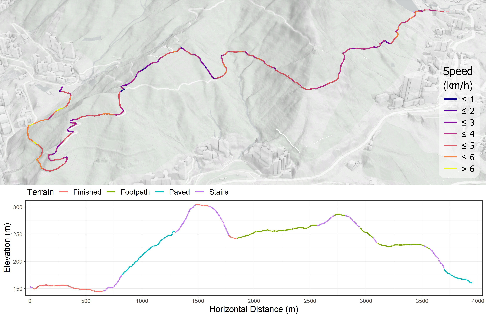
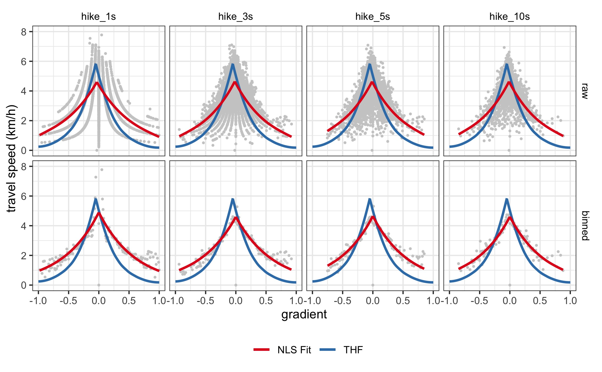
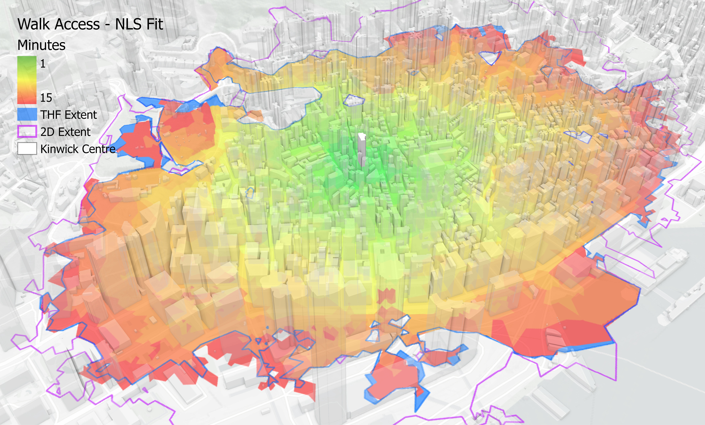

```{r load packages, message = FALSE, include = FALSE}
library(broom)
library(huxtable)
library(magrittr)
library(tidyverse)
library(sf)
library(tmap)

knitr::opts_chunk$set(echo = FALSE)
knitr::opts_chunk$set(fig.path = "img/")
```

```{r define helper functions}
tobler_f <- function(a, g, b1, b2){a * exp(-b1*abs(g + b2))}

distance2D <- function(x1, x2, y1, y2){
  dist2D <- sqrt((x2 - x1)^2 + (y2 - y1)^2)
  return(dist2D)}

distance3D <- function(x1, x2, y1, y2, z1, z2){
  dist3D <- sqrt((x2 - x1)^2 + (y2 - y1)^2 + (z2 - z1)^2)
  return(dist3D)}

df_prep <- function(df){
  df %<>% transmute(start_time = time, start_z = ele, geometry) %>% 
  cbind(st_coordinates(df)) %>%
  st_drop_geometry() %>%
  rename(start_x = X, start_y = Y)
  return(df)}

df_calculate <- function(df, row_dur){
  # first see if the row duration value is 1, if so just keep the original df
  ifelse(row_dur != 1, 
          calc_df <- df %>% filter(row_number() %% row_dur == 1), 
          calc_df <- df)
  
  calc_df %<>%
  mutate(end_time = lead(start_time),
         end_x = lead(start_x),
         end_y = lead(start_y),
         end_z = lead(start_z),
         duration = as.numeric(end_time - start_time),
         length3D = distance3D(start_x, end_x, start_y, end_y, start_z, end_z),
         speed = (length3D/duration) * 3.6,
         gradient = (end_z - start_z)/distance2D(start_x, end_x, start_y, end_y),
         #bin = cut(gradient, breaks=c(-1, seq(-1.025, 1.025, by=.01)), labels=seq(-1, 1.01, .01)),
         #bin = as.numeric(as.character(bin))
         bin = round(gradient, digits = 2)) %>% 
  
  # keep only the selected intervals and gradients between -1 and 1
  filter(duration == row_dur, 
         between(gradient, -1, 1))
  return(calc_df)}
```

```{r prepare fig 1 profile graph, message = FALSE, warning = FALSE, eval = FALSE, fig.width = 7, fig.height = 3}
april_29_profile <- st_read("./arcgis_pro/hiking_with_tobler.gdb", layer = "hike_april_29") %>% 
  rename(geometry = Shape) %>%
  st_cast(., "LINESTRING")
  
april_29_profile %<>%
  cbind(as.data.frame(st_coordinates(st_line_sample(april_29_profile, sample = 0))) %>% # get start point coordinates
          select(-L1) %>%
          rename(x1 = X, y1 = Y, z1 = Z)) %>%
  cbind(as.data.frame(st_coordinates(st_line_sample(april_29_profile, sample = 1))) %>% # get end point coordinates
          select(-L1) %>%
          rename(x2 = X, y2 = Y, z2 = Z)) %>%
  mutate(dist2D = distance2D(x1, x2, y1, y2),
         dist_roll = cumsum(dist2D))

fig_1_bottom <- ggplot(april_29_profile, aes(x = dist_roll, y = z2, color = Terrain)) + 
  theme_bw() +
  geom_line(aes(x = dist_roll, y = z2, group = 1), size = 1) + 
  xlab("Horizontal Distance (m)") +
  ylab("Elevation (m)") +
  scale_x_continuous(breaks = seq(0, 4000, by = 500), expand = c(0.01, 0.01), limits = c(0, 4000)) +
  theme(legend.position='top', 
        legend.justification='left',
        legend.direction='horizontal',
        legend.margin=margin(t=-0.1, r=0, b=-0.2, l=0.1, unit="cm"),
        axis.title = element_text(size=14),
        legend.text = element_text(size=12),
        legend.title = element_text(size=14))

ggsave(fig_1_bottom, filename = "./img/Fig_1_bottom.jpg", device = "jpg", width = 11, height = 3)
```

```{r load and prepare gpx data, include = FALSE}
hike_april_22 <- st_read("./data/hike_april_22.gpx", layer = "track_points") %>% st_transform(crs = 2326) %>% df_prep()
hike_april_29 <- st_read("./data/hike_april_29.gpx", layer = "track_points") %>% st_transform(crs = 2326) %>% df_prep()
hike_may_1 <- st_read("./data/hike_may_1.gpx", layer = "track_points") %>% st_transform(crs = 2326) %>% df_prep()
hike_may_19 <- st_read("./data/hike_may_19.gpx", layer = "track_points") %>% st_transform(crs = 2326) %>% df_prep()

hike_data <- list(
  hike_1s = rbind(df_calculate(hike_april_22, 1), df_calculate(hike_april_29, 1), df_calculate(hike_may_1, 1), df_calculate(hike_may_19, 1)) %>% 
    mutate(data = "hike_1s", type = "raw"),
  hike_3s = rbind(df_calculate(hike_april_22, 3), df_calculate(hike_april_29, 3), df_calculate(hike_may_1, 3), df_calculate(hike_may_19, 3))  %>% 
    mutate(data = "hike_3s", type = "raw"),
  hike_5s = rbind(df_calculate(hike_april_22, 5), df_calculate(hike_april_29, 5), df_calculate(hike_may_1, 5), df_calculate(hike_may_19, 5))  %>% 
    mutate(data = "hike_5s", type = "raw"),
  hike_10s = rbind(df_calculate(hike_april_22, 10), df_calculate(hike_april_29, 10), df_calculate(hike_may_1, 10), df_calculate(hike_may_19, 10)) %>% 
    mutate(data = "hike_10s", type = "raw"))

hike_data <- bind_rows(hike_data)

hike_data_binned <- list(
  hike_1s_binned = hike_data %>% filter(data == "hike_1s") %>% group_by(bin) %>% 
    summarize(bin_speed = mean(speed)) %>% rename(gradient = bin, speed = bin_speed) %>% 
    mutate(data = "hike_1s", type = "binned"),
  hike_3s_binned = hike_data %>% filter(data == "hike_3s") %>% group_by(bin) %>% 
    summarize(bin_speed = mean(speed)) %>% rename(gradient = bin, speed = bin_speed) %>% 
    mutate(data = "hike_3s", type = "binned"),
  hike_5s_binned = hike_data %>% filter(data == "hike_5s") %>% group_by(bin) %>% 
    summarize(bin_speed = mean(speed)) %>% rename(gradient = bin, speed = bin_speed) %>% 
    mutate(data = "hike_5s", type = "binned"),
  hike_10s_binned = hike_data %>% filter(data == "hike_10s") %>% group_by(bin) %>% 
    summarize(bin_speed = mean(speed)) %>% rename(gradient = bin, speed = bin_speed) %>% 
    mutate(data = "hike_10s", type = "binned"))

hike_data_binned <- bind_rows(hike_data_binned)
```

```{r estimate nls models, warning = FALSE, message = FALSE}
hike_data_nls_fit <- list(
  hike_1s = nls(speed ~ tobler_f(a, g = gradient, b1, b2), start = list(a = 6, b1 = 3.5, b2 = 0.05), 
                    data = hike_data %>% filter(data == "hike_1s" & type == "raw")),
  hike_3s = nls(speed ~ tobler_f(a, g = gradient, b1, b2), start = list(a = 6, b1 = 3.5, b2 = 0.05), 
                    data = hike_data %>% filter(data == "hike_3s" & type == "raw")),
  hike_5s = nls(speed ~ tobler_f(a, g = gradient, b1, b2), start = list(a = 6, b1 = 3.5, b2 = 0.05), 
                    data = hike_data %>% filter(data == "hike_5s" & type == "raw")),
  hike_10s = nls(speed ~ tobler_f(a, g = gradient, b1, b2), start = list(a = 6, b1 = 3.5, b2 = 0.05), 
                     data = hike_data %>% filter(data == "hike_10s" & type == "raw")),
  hike_1s_binned = nls(speed ~ tobler_f(a, g = gradient, b1, b2), start = list(a = 6, b1 = 3.5, b2 = 0.05), 
                       data = hike_data_binned %>% filter(data == "hike_1s"& type == "binned")),
  hike_3s_binned = nls(speed ~ tobler_f(a, g = gradient, b1, b2), start = list(a = 6, b1 = 3.5, b2 = 0.05), 
                           data = hike_data_binned %>% filter(data == "hike_3s"& type == "binned")),
  hike_5s_binned = nls(speed ~ tobler_f(a, g = gradient, b1, b2), start = list(a = 6, b1 = 3.5, b2 = 0.05), 
                           data = hike_data_binned %>% filter(data == "hike_5s"& type == "binned")),
  hike_10s_binned = nls(speed ~ tobler_f(a, g = gradient, b1, b2), start = list(a = 6, b1 = 3.5, b2 = 0.05), 
                            data = hike_data_binned %>% filter(data == "hike_10s"& type == "binned"))
)
names(hike_data_nls_fit) <- c("1s_raw", "3s_agg", "5s_agg", "10s_agg", "1s_bin", "3s_bin", "5s_bin", "10s_bin")

nls_results <- huxreg(hike_data_nls_fit, statistics = c("N" = "nobs", "AIC", "BIC")) %>% 
  set_width(1) %>% 
  set_caption("Table 1. NLS Model Results")
#nls_results
#quick_docx(nls_results, file = "./nls_results.docx")
```

```{r get parameters and prepare data for faceting}
hike_data_nls_params <- list(
  hike_data_nls = hike_data %>% group_by(data) %>%
  do(nls_fit = tidy(nls(speed ~ tobler_f(a, g = gradient, b1, b2), 
                        start = list(a = 6, b1 = 3.5, b2 = 0.05), data = .))) %>% 
  unnest(nls_fit) %>% mutate(type = "raw"),

  hike_data_binned_nls = hike_data_binned %>% group_by(data) %>%
  do(nls_fit = tidy(nls(speed ~ tobler_f(a, g = gradient, b1, b2), 
                        start = list(a = 6, b1 = 3.5, b2 = 0.05), data = .))) %>% 
  unnest(nls_fit) %>% mutate(type = "binned")
)

hike_data_nls_params <- bind_rows(hike_data_nls_params) %>% 
  mutate(estimate = if_else(p.value <= 0.05, estimate, 0)) %>% 
  pivot_wider(id_cols = c(data, type), names_from = c(term), values_from = estimate)

facet_data <- rbind(hike_data %>% transmute(data, speed, gradient, type), 
                    hike_data_binned %>% transmute(data, speed, gradient, type)) %>% 
  left_join(hike_data_nls_params, by = c("data", "type")) %>% 
  # add in some dummy ones equal to b2 so that the function line reaches its max in the graphs
  rbind(hike_data_nls_params %>% transmute(data, speed = 0, gradient = -1*b2, type, a, b1, b2)) %>%
  
  # calculate predicted speeds for left and right sides of function line
  mutate(pred_speed_l = if_else(gradient <= -1*b2, tobler_f(a = a, g = gradient, b1 = b1, b2 = b2), NA_real_),
         pred_speed_r = if_else(gradient >= -1*b2, tobler_f(a = a, g = gradient, b1 = b1, b2 = b2), NA_real_),
         data = fct_relevel(data, "hike_1s", "hike_3s", "hike_5s", "hike_10s"),
         type = fct_relevel(type, "raw", "binned")) 

# create some fake data for the tobler function line
tobler_df <- data.frame(gradient = seq(from = -1, to = 1, by=0.01)) %>% 
  mutate(gradient = round(gradient, 2), # round so that floats can be compared
         speed_l = if_else(gradient <= -0.05, tobler_f(a = 6, g = gradient, b1 = 3.5, b2 = 0.05), NA_real_),
         speed_r = if_else(gradient >= -0.05, tobler_f(a = 6, g = gradient, b1 = 3.5, b2 = 0.05), NA_real_))
```

```{r graph fit models, warning = FALSE, include = FALSE}
fig_2 <- ggplot(facet_data, aes(gradient, speed)) + 
  theme_bw() +
  facet_grid(cols = vars(data), rows = vars(type)) +
  geom_point(size = .5, colour = "grey80") +
  ylim(0, 8) +
  xlab("gradient") +
  ylab("travel speed (km/h)") +
  labs(colour="impedance f") +
  coord_cartesian(xlim = c(-1, 1)) +
  theme(legend.position = "bottom",
        legend.title = element_blank(),
        strip.text = element_text(colour = "black"),
        panel.spacing = unit(.25, "lines"),
        strip.background = element_blank()) +
  stat_smooth(aes(x = gradient, y = speed_l, colour = "THF"), se = FALSE, formula = y ~ x, method = "loess", data = tobler_df) +
  stat_smooth(aes(x = gradient, y = speed_r, colour = "THF"), se = FALSE, formula = y ~ x, method = "loess", data = tobler_df) +
  stat_smooth(aes(x = gradient, y = pred_speed_l, colour = "NLS Fit"), method = "gam", formula =  y ~ s(x, bs = "cs"), se = FALSE) +
  stat_smooth(aes(x = gradient, y = pred_speed_r, colour = "NLS Fit"), method = "gam", formula =  y ~ s(x, bs = "cs"), se = FALSE) +
  scale_colour_manual(name="legend", values=c("#E41A1C", "#377EB8"))

ggsave(fig_2, filename = "./img/Fig_2.jpg", device = "jpg", width = 7.29, height = 4.51)
```

```{r analyze accessibility data}
odcm_2D <- read.csv("./arcgis_pro/Walk_2D.csv") %>% 
  separate(Name, into = c("origin", "destination"), sep = " - ") %>% 
  mutate(access_2D = case_when(Total_Walk_2D <= 15 ~ 1, TRUE ~ 0))

odcm_NLS <- read.csv("./arcgis_pro/Walk_NLS.csv") %>% 
  separate(Name, into = c("origin", "destination"), sep = " - ") %>% 
  mutate(access_NLS = case_when(Total_Walk_NLS <= 15 ~ 1, TRUE ~ 0))

odcm_TOB <- read.csv("./arcgis_pro/Walk_Tobler.csv") %>% 
  separate(Name, into = c("origin", "destination"), sep = " - ") %>% 
  mutate(access_TOB = case_when(Total_Walk_Tobler <= 15 ~ 1, TRUE ~ 0))

access_results <- odcm_2D %>% 
  transmute(origin, access_2D) %>% 
  left_join(odcm_NLS %>% transmute(origin, access_NLS), by = "origin") %>%
  left_join(odcm_TOB %>% transmute(origin, access_TOB), by = "origin") %>%
  summarize(access_NLS = sum(access_NLS),
            access_TOB = sum(access_TOB),
            access_2D = sum(access_2D))
```

# QUESTIONS

Hong Kong is an intensely three-dimensional city, not only in terms of its complex 'volumetric' built environment [@bruyns2020] but also its mountainous terrain. While working at the Hong Kong Polytechnic University, I took up hiking on the city's extensive trail network. But as a quantitative geographer with a general interest in the potential of sensors for personalized urban data analysis, I could not help but to combine work and leisure activities and utilized my mobile phone and smartwatch to capture data on my physical performance. On a personal level, I became interested in how closely my captured travel trajectories align with the speeds predicted by Tobler's [-@tobler1993] 'hiking function'.

On the professional side, I am also broadly interested in the use of cost functions for accessibility analysis. Modelling pedestrian accessibility on a 3D network requires the use of an anisotropic cost function and while Tobler's Hiking Function (THF) has a long history of applications in the field of archaeology, Goodchild [-@goodchild2020] comments on the increasing usefulness of hiking functions in a variety of topic areas in geographical analysis (and includes an early graph of this paper's data). Indeed, the THF is increasingly utilized as a cost function in 3D surface (e.g. water access in Páez et al. [-@paez2020]) and linear network (e.g. access to rapid transit stations in Higgins [-@higgins2019]) analysis. Other researchers have used new sources of activity data to calibrate different cost functions [@brundson2018; @campbell2019; @irmischer2017; @pingel2010]. Some type of hiking function also appears to underpin routing suggestions on sloped terrain in Google Maps [@goodchild2020].

However, the original THF was calibrated to coarse isoline data from Imhof [-@imhof1950] and while its predicted speeds may be suitable for modelling movement on unimproved terrain, it is not clear how well its predictions extend to walking in an urban 3D network context. Alternative cost functions could be calibrated for urban walking specifically, but obtaining accurate GPS trajectories is challenging in "urban canyon" contexts like Hong Kong [@ji2010]. In response, this research utilizes trajectory data captured on trails that exhibit terrain types similar to what would be found in more urban walking environments to calibrate a bespoke cost function. I then use the function to estimate personalized accessibility to an urban amenity on a 3D network.

# METHODS

I collected trajectory data over 4 hikes on the trails around Lung Fu Shan peak and the Pinewood Battery behind the University of Hong Kong in Central and Western District in 2018. The trails themselves feature dirt footpaths, segments finished with stone/concrete pavers and pavement, and stairs at the steepest sections, making them a useful proxy for more urban walking. Data were collected using an Apple iPhone 8 and Apple Watch Series 1 through the 'Outdoor Walk' tracking in the Fitness application. This device combination captures latitude and longitude positioning using the iPhone's GPS receiver, height from sea level using the barometer (precision of 0.1m), and heart rate readings using from Apple Watch. The phone applies some smoothing algorithm to the GPS data and can also use the accelerometer and gyroscope in the watch to augment positional accuracy in areas with poor or no GPS signal, although these features are opaque to the user. Readings were captured from the sensors at 1-second intervals. The resulting workouts were exported as `.gpx` files using the Run Gap app for iOS. The trajectories were cleaned to remove the beginning of the walk to the trail (where the accuracy of GPS readings is compromised by tall buildings) and a handful of stops to rest during the hikes. Figure \ref{fig:fig-profile} shows the trajectories and a combined terrain (derived from Google Street View) and elevation profile for one of the hikes.

```{r fig-profile, fig.cap="April 29 Hike Trajectory and Profile", out.width = '100%', fig.pos = 'H'}

```

To model travel speeds, Tobler's [-@tobler1993] hiking function uses an exponential function to estimate the connection between velocity and slope:

$$
v = \alpha * e^{(-\beta_1 |g + \beta_2|)}
$$

Where $v$ is walking velocity in km/h, $\alpha$ is a constant that controls the maximum velocity, $g$ is the gradient of the terrain measured as the tangent of the angle of the slope in the direction of travel, $\beta_1$ controls the rate of decline as the gradient increases, and $\beta_2$ offsets the gradient by some amount to capture how walking speeds are highest on a slight downward slope. In Tobler's original formulation, $\alpha = 6 kph$, $\beta_1 = 3.5$, and $\beta_2 = 0.05$ so that the maximum walking velocity of 6 km/h is achieved at a gradient of -5%. I use nonlinear least squares to fit the generalized hiking function to the trajectory data and compare my walk speeds with that predicted by Tobler's formulation. To test the sensitivity of the estimated results to the temporal scale of the trajectory data, I employed two aggregation strategies including collapsing the trajectories into 3s, 5s, and 10s time intervals and calculating average speeds at 1% gradient intervals.

For the accessibility analysis, a 3D pedestrian network [@landsd2021; @sun2019] is prepared in a similar manner to that outlined in Higgins [-@higgins2019], including splitting links into 10m or less segments to improve the accuracy of slope-based travel times and specifying anisotropic travel costs. For simplicity, the travel speed of any mechanized links (e.g. travelator, elevator) is set to 2km/h and the maximum gradient is capped at $\pm{100}$%. To estimate the effects of the bespoke cost function on personalized accessibility analysis, a simple scenario is crafted wherein I examine the spatial distribution of buildings within a 15 min walk of the Kinwick Centre. This building houses a grocery store and gym and is an interesting destination due to its location in the topographically-rich SoHo neighbourhood about halfway up the 800m Central-Mid-Levels escalator system. Using ArcGIS Pro, travel times are calculated three times: using the fit function and the THF to account for slope and a third time assuming the network is 2D with a constant walk speed of 5km/h. Data and code notebooks for reproducing the analysis are available in a GitHub repository\footnote{\url{https://github.com/higgicd/hiking_with_tobler}}.

# FINDINGS

Results of the NLS models are presented in Table \ref{tab:tab-result} and graphed in Figure \ref{fig:fig-fit}. The sensitivity analysis suggests that the models are reasonably stable in parameters across all model specifications. The exception is the $\beta_2$ offset parameter which is insignificant in all binned models, indicating the cost curves in this category are estimated to be symmetric around a 0% gradient. Recognizing that neither AIC nor BIC are useful for comparing model fit across different sample sizes, I focus on the results for the original raw 1s data. Results indicate that my maximum walking speed of about 4.6km/h occurs on about a -3.3% gradient rather than the -5% in Tobler's formulation. My average flat-ground walking speed is also a bit slower than what Tobler [-@tobler1993] would predict at about 4.4 km/h. On the other hand, I tend to be faster on higher slopes than predicted by the original THF, likely due to the prevalence of staircases on the steepest sections of the trail.

```{r tab-result, tab.cap="NLS Model Results", fig.pos = 'H'}
nls_results
```

```{r fig-fit, fig.cap="THF and NLS Fit Functions", out.width = '100%', fig.pos = 'H'}

```

Accessibility results for the three travel cost scenarios reveal that the function fit to my travel performance leads to `r prettyNum((access_results[1,1]), big.mark = ",")` buildings within a 15 min walk to the Kinwick Centre, which is `r prettyNum(abs(round(((access_results[1,1]/access_results[1,2])-1)*100, 1)))`% less than the number estimated using the original THF. This similarity suggests some trade-offs are occurring between my lower speeds on flatter ground and higher speeds on steeper slopes compared to the THF when routing on the network. For comparison, assuming the network was 2D would result in `r prettyNum((access_results[1,3]), big.mark = ",")` buildings within a 15 min walk which would overestimate my accessibility by about `r prettyNum(round(((access_results[1,3]/access_results[1,1])-1)*100, 1))`% and `r prettyNum(round(((access_results[1,3]/access_results[1,2])-1)*100, 1))`% compared to the 3D network using my fit function and the THF respectively. To highlight these differences, Figure \ref{fig:fig-iso} shows 15 min isochrones calculated to the Kinwick Centre for the three cost scenarios.

While the data uncertainty caveats outlined in Goodchild [-@goodchild2020] apply in the calibration of the bespoke cost function and propagate to the accessibility analysis, these findings indicate the strong role of cost functions in calculating accessibility on 3D networks and the overestimation of access that can occur when assuming networks are flat. My results also suggest the potential for the THF to under-estimate walking speeds on steeper slopes in more urban contexts where stairs are common. However, while the trails used to calibrate my cost function are arguably more reflective of urban walking conditions than the unimproved terrain used to calibrate the original THF, confirming this hypothesis and increasing confidence in the generalizability of the results will require further research with a sample size $n>1$. Nevertheless, the proliferation of sensors on consumer-grade smart devices and the suite of movement data they collect offer exciting new opportunities for calibrating cost functions that can be utilized for accessibility research and to personalize suggestions for routing on networks rich in topography.

```{r fig-iso, fig.cap="Walk Access Isochrone - NLS Fit Function", out.width = '100%', fig.pos = 'H'}

```

# REFERENCES
